<h1>
    Vertex Ordering and Coloring Algorithms for Graphs
</h1>

<h4> 
This project looks at implementing an algorithm in multiple ways to solve a problem, analyzing the 
algorithms’ implementations for running time, and testing and your implementations to show they 
match your analysis. The project also looks at testing to determine how well the multiple 
implementations solve the problem. 
</h4>
<h4>
The particular problem for the project is scheduling via graph coloring.  For the first part of the project, 
different conflict graphs which can represent real world problems will be created and saved in files. For 
the second part of the problem, various coloring orders will be implemented and analyzed for runtime 
efficiency and coloring efficiency. These efficiencies are intimately related to the data structures used 
for both the input graph data and the intermediate data necessary for the ordering and coloring 
algorithms.   
</h4>

<h3>
PURPOSE
</h3>

Part 1 of the project is used to create different conflict graphs. Conflict graphs represent real-world 
problems. For example, one may be thought of as a set of vertices representing courses that students 
may take. An edge is present between two vertices (courses) in the graph if a student is taking both 
courses. This edge indicates they may not be scheduled at the same time. Once the graph is colored, the 
color of each vertex represents its timeslot and the total number of colors would represent the total 
number of required timeslots for that coloring.

<h3>Computing Environment:</h3>

The machine used to create, test, and output these programs is a 2020 M1 13-inch Macbook Pro with 16GB RAM and 1TB of SSD storage. 
I will utilize Go as the programming language to write these programs in. I will utilize R to output the graphs that will be analyzed in this report as well. 
The timing mechanisms used to time these programs are the Go standard library time libraries, in which we use timestamps and utilize the difference between when the program starts and finishes. 
We will use a precision of nanoseconds for this.

<h3>Graph Creation</h3>
<h4><a href="GraphCreation">Complete</a></h4>

Creating a complete graph is an O(V&sup2) operation (with V being the number of vertices in the graph)  because for each vertex, we have to add V - 1 vertices to its list.

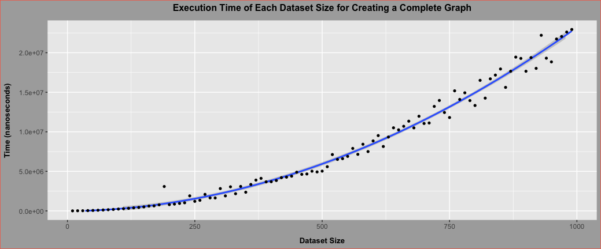

The pattern shows an extremely strong quadratic pattern.

<h4>Cycle</h4>

Creating a complete graph is an O(V) operation (with V being the number of vertices in the graph)  because for each vertex, we only have to add 1 vertex to its list. 

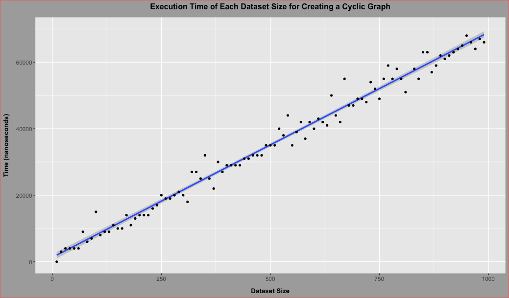

The pattern shows an extremely strong quadratic pattern.

<h4>Random Tiered</h4>

Creating a complete graph is an O(V+E) operation (with V being the number of vertices in the graph and E being the number of edges)  because we randomly pick two unique vertices and make them an edge. We do this until we get a specific number of edges.

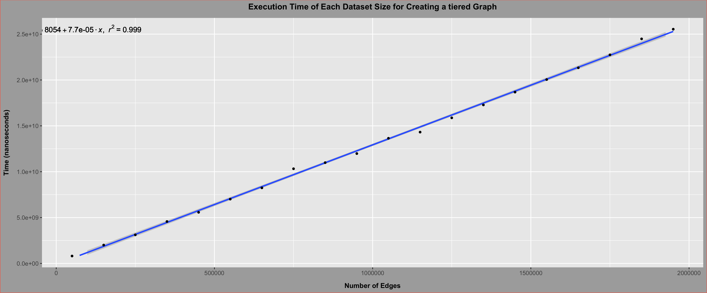

The pattern is extremely strong as we can see an r&sup2 of .999, so there is an extremely strong linear pattern.
 For this distribution, the first 10% of vertices have ~50% of the edges, because when randomly choosing two random vertices, the selection process has a 50% bias towards the first 10% of vertices.

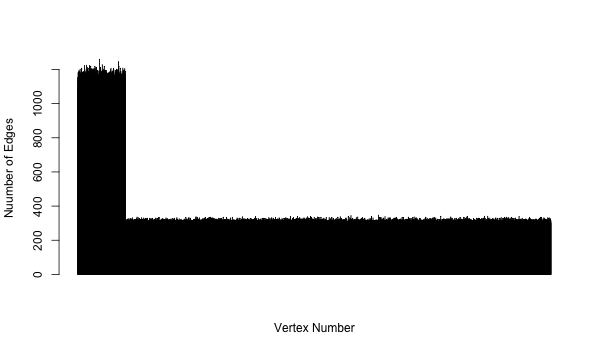
<h4>Random Double Tiered</h4>

Creating a complete graph is an O(V+E) operation (with V being the number of vertices in the graph and E being the number of edges)  because we randomly pick two unique vertices and make them an edge. We do this until we get a specific number of edges.

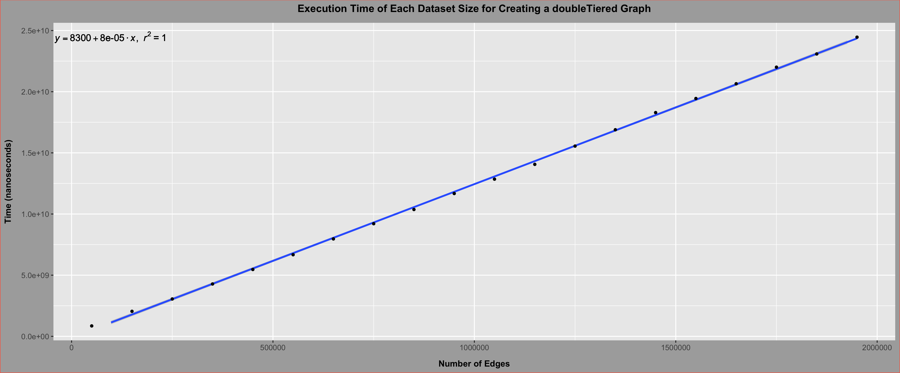

The pattern is extremely strong as we can see an r&sup2 of 1, so there is an extremely strong linear pattern.
 For this distribution, the first and last 10% of vertices each have ~25% of the edges, because when randomly choosing two random vertices, the selection process has a 25% bias towards the first, 25% towards the last 10% and 50% for the middle 80% of vertices.

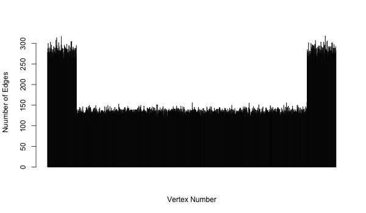
<h4>Random Uniform</h4>

Creating a complete graph is an O(V+E) operation (with V being the number of vertices in the graph and E being the number of edges)  because we randomly pick two unique vertices and make them an edge. We do this until we get a specific number of edges.

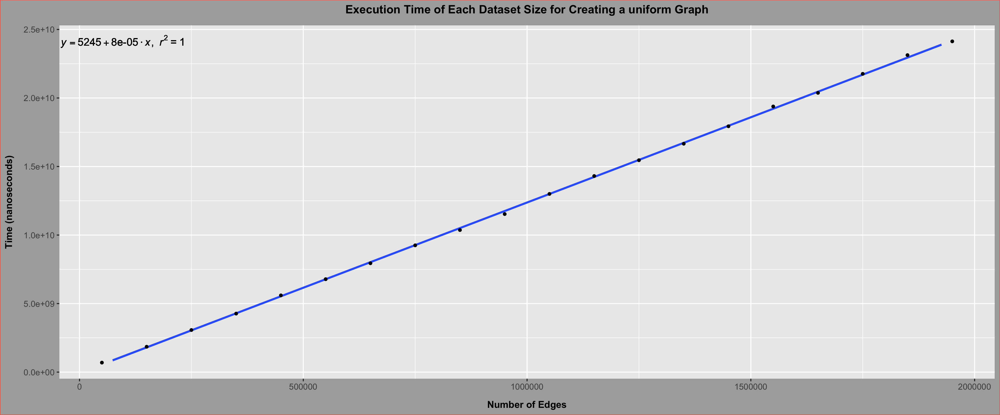

The pattern is extremely strong as we can see an r&sup2 of 1, so there is an extremely strong linear pattern.
 This distribution is uniformly distributed.

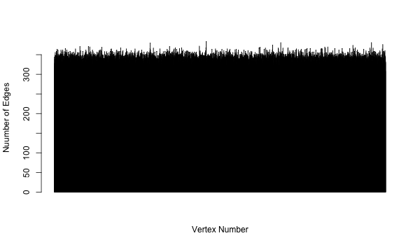

<h3>Vertex Ordering</h3>
<h4>Smallest Last Vertex Order</h4>
<h5>Algorithm Walkthrough<h5>

    

        

        [  
            &nbsp &nbsp 1: [ 3, 4, 5, 6 ]  
            &nbsp &nbsp 2: [ 3, 6 ]  
            &nbsp &nbsp 3: [ 1, 2 ]  
            &nbsp &nbsp 4: [ 1, 6 ]  
            &nbsp &nbsp 5: [ 1 ]  
            &nbsp &nbsp 6: [ 1, 2,  4 ]  
        ]
        

    

    

        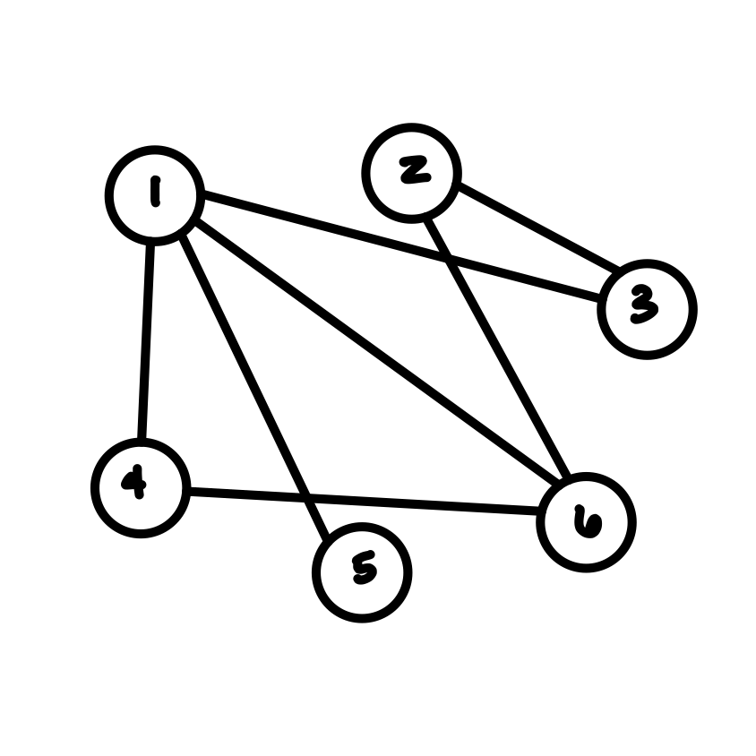
    

This algorithm would execute in this manner:

<ol>
<li>
degrees: [ nil, [ 5 ], [ 2, 3, 4 ], [ 6 ], [ 1 ] ]  
listNodes: [ 0x123, 0x234, 0x345, 0x456, 0x567, 0x678]  
actualDegrees: [ 4, 2, 2, 2, 1, 3 ]  
taken: [ false, false, false, false, false, false ]  
finalQueue: []  
</li>
<li>
(Start of for removing vertices)  
degrees: [ nil, [ 5 ], [ 2, 3, 4 ], [ 6 ], [ 1 ] ]  
listNodes: [ 0x123, 0x234, 0x345, 0x456, 0x567, 0x678]  
actualDegrees: [ 4, 2, 2, 2, 1, 3 ]  
taken: [ false, false, false, false, false, false ]  
finalQueue: []  
removedVertex: 5  
minDegree = 1  
Adjacent vertices that were decremented: [ 1 ]  
Changed listNodes -> [ 0x124, 0x234, 0x345, 0x456, 0x567, 0x678]  
Changed taken -> [ false, false, false, false, true, false ]  
Changed degrees ->  [ nil, [ ], [ 2, 3, 4 ], [ 6, 1 ], [] ]  
Changed actualDegrees -> [ 3, 2, 2, 2, 1, 3 ]  
Changed finalQueue -> [ 5 ]  
</li>
<li>
degrees: [ nil, [ ], [ 2, 3, 4 ], [ 6, 1 ], [] ]  
listNodes: [ 0x124, 0x234, 0x345, 0x456, 0x567, 0x678]  
actualDegrees: [ 3, 2, 2, 2, 1, 3 ]  
taken: [ false, false, false, false, true, false ]  
finalQueue: [ 5 ]  
removedVertex: 4  
minDegree = 2  
Adjacent vertices that were decremented: [ 1, 6 ]  
Changed listNodes -> [ 0x125, 0x234, 0x345, 0x456, 0x567, 0x679]  
Changed taken -> [ false, false, false, true, true, false ]  
Changed degrees ->  [ nil, [ ], [ 2, 3, 6, 1 ], [], [] ]  
Changed actualDegrees -> [ 2, 2, 2, 2, 1, 2 ]  
Changed finalQueue -> [ 4, 5 ]  
</li>
<li>
degrees: [ nil, [ ], [ 2, 3, 6, 1 ], [], [] ]  
listNodes: [ 0x125, 0x234, 0x345, 0x456, 0x567, 0x679]  
actualDegrees: [ 2, 2, 2, 2, 1, 2 ]  
taken: [ false, false, false, true, true, false ]  
finalQueue: [ 4, 5 ]  
removedVertex: 1  
minDegree = 1  
Adjacent vertices that were decremented: [ 3, 6 ]  
Changed listNodes -> [ 0x125, 0x234, 0x346, 0x456, 0x567, 0x67a]  
Changed taken -> [ true, false, false, true, true, false ]  
Changed degrees ->  [ nil, [ 3, 6 ], [ 2 ], [], [] ]  
Changed actualDegrees -> [ 2, 2, 1, 2, 1, 1 ]  
Changed finalQueue -> [ 1, 4, 5 ]  
</li>
<li>
degrees: [ nil, [ 3, 6 ], [ 2 ], [], [] ]  
listNodes: [ 0x125, 0x234, 0x346, 0x456, 0x567, 0x67a]  
actualDegrees:[ 2, 2, 1, 2, 1, 1 ]  
taken: [ true, false, false, true, true, false ]  
finalQueue:  [ 1, 4, 5 ]  
removedVertex: 6  
minDegree = 1  
Adjacent vertices that were decremented: [ 2 ]  
Changed listNodes -> [ 0x125, 0x235, 0x346, 0x456, 0x567, 0x67a]  
Changed taken -> [ true, false, false, true, true, true ]  
Changed degrees ->  [ nil, [ 3, 2 ], [], [], [] ]  
Changed actualDegrees -> [ 2, 1, 1, 2, 1, 1 ]  
Changed finalQueue -> [ 6, 1, 4, 5 ]  
</li>
<li>
degrees:  [ nil, [ 3, 2 ], [], [], [] ]  
listNodes: [ 0x125, 0x235, 0x346, 0x456, 0x567, 0x67a]  
actualDegrees:[ 2, 1, 1, 2, 1, 1 ]  
taken: [ true, false, false, true, true, true ]  
finalQueue: [ 6, 1, 4, 5 ]  
removedVertex: 2  
minDegree = 0  
Adjacent vertices that were decremented: [ 3 ]  
Changed listNodes -> [ 0x125, 0x235, 0x347, 0x456, 0x567, 0x67a]  
Changed taken -> [ true, true, false, true, true, true ]  
Changed degrees ->  [ [3], [], [], [], [] ]  
Changed actualDegrees -> [ 2, 1, 0, 2, 1, 1 ]  
Changed finalQueue -> [ 2, 6, 1, 4, 5 ]  
</li>
<li>
degrees:  [ [3], [], [], [], [] ]  
listNodes: [ 0x125, 0x235, 0x347, 0x456, 0x567, 0x67a]  
actualDegrees: [ 2, 1, 0, 2, 1, 1 ]  
taken: [ true, true, false, true, true, true ]  
finalQueue: [ 2, 6, 1, 4, 5 ]  
removedVertex: 3  
minDegree = 0  
Adjacent vertices that were decremented: []  
Changed listNodes -> [ 0x125, 0x235, 0x347, 0x456, 0x567, 0x67a]  
Changed taken -> [ true, true, true, true, true, true ]  
Changed degrees ->  [ [], [], [], [], [] ]  
Changed actualDegrees -> [ 2, 1, 0, 2, 1, 1 ]  
Changed finalQueue -> [ 3, 2, 6, 1, 4, 5 ]  
</li>
</ol>

This gives us the final vertex ordering of this (first is the vertex number, second is the degree when deleted): <b>[ {3, 0}, {2, 1}, {6, 1}, {1, 2}, {4, 2}, {5, 1}] </b>, in order of last the first element being the most recently deleted.

Analyzing this Smallest Last Vertex Order Algorithm Implementation gives us a O(V + E) runtime with V being the number of vertices in the graph and E being the number of edges. I will leave annotations in the code snippet, but here is a summary of the runtime complexity:

The implementation will iterate through all the degrees and the maximum degrees a vertex can have is the total number of vertices in the graph minus one. Therefore this iteration will run max V times. For each iteration, if there is a list at the degree, then the implementation will remove the last element in the linked list, which is a constant time operation. Then the implementation  will iterate through then remove vertex’s adjacent vertices (that have not been removed), and based on the minimum degree of the adjacent degrees, the implementation can go back max 2 iterations. So every edge will be explored at most once before the implementation ends, with constant time additional work for each iteration.

<h4>
Visualization
</h4>

For my special random double tiered distribution graph with 5000 vertices, we see this linear pattern when timing the Smallest Last Vertex Order Implementation:

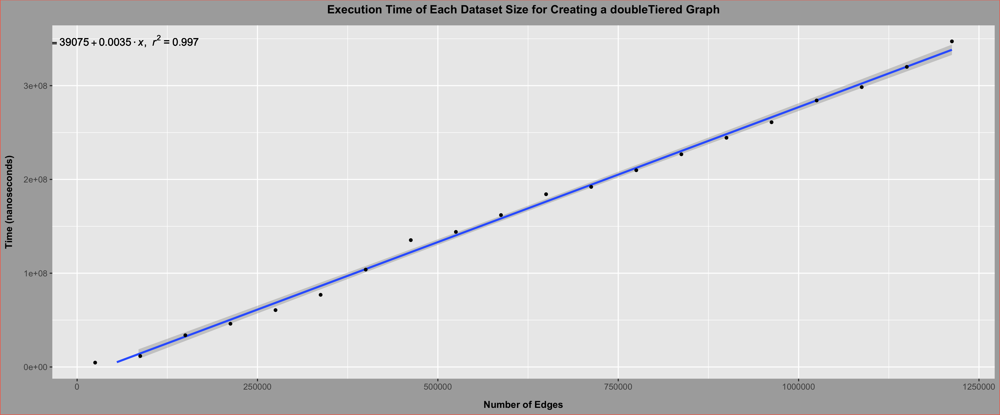

The pattern is extremely strong as we can see an r&sup2 of .997, so there is an extremely strong linear pattern.

For my random tiered distribution graph with 10000 vertices, we see this linear pattern when timing the Smallest Last Vertex Order Implementation:

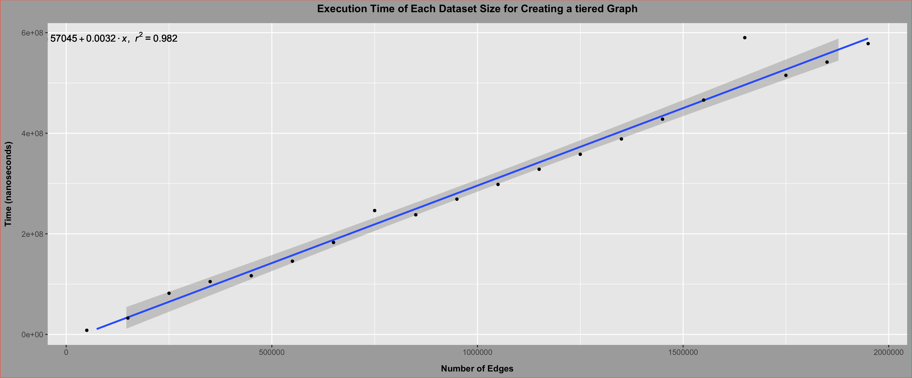

The pattern is extremely strong as we can see an r&sup2 of .998, so there is an extremely strong linear pattern.
Here is a table showing the largest deleted degree and largest color used for 5000 vertices:

<table>
    <thead>
        <th>
            Graph Type
        </th>
        <th>
            Largest Deleted Degree
        </th>
        <th>
            Largest Color Used
        </th>
    </thead>
    <tbody>
        <tr>
            <td>
                complete
            </td>
            <td>
                4999
            </td>
            <td>
                5000
            </td>
        </tr>
        <tr>
            <td>
                cycle
            </td>
            <td>
                1
            </td>
            <td>
                2
            </td>
        </tr>
        <tr>
            <td>
                Random tiered dist
            </td>
            <td>
                350
            </td>
            <td>
                851
            </td>
        </tr>
        <tr>
            <td>
                Random double tiered dist
            </td>
            <td>
                337
            </td>
            <td>
                1359
            </td>
        </tr>
        <tr>
            <td>
                Random uniform dist
            </td>
            <td>
                423
            </td>
            <td>
                492
            </td>
        </tr>
    </tbody>
</table>

The maximum original degree of the vertices in the graph determine the maximum number of colors that may need to be used for the graph. The largest deleted degree is the minimum number of colors that may need to be used for the graph.

<h3>
    Smallest Original Vertex Order
</h3>

Analyzing this Smallest Original Vertex Order Algorithm Implementation gives us a O(V) runtime with V being the number of vertices in the graph. I will leave annotations in the code snippet, but here is a summary of the runtime complexity:

The implementation will iterate through all the degrees and the maximum degrees a vertex can have is the total number of vertices in the graph minus one. Therefore this iteration will run max V times. For each iteration it will add the vertices that have the current number of degrees to the final queue, and these insertions are a constant time operation.

<h4>
Visualization
</h4>

For my special random double tiered distribution graph with 9000 vertices, we see this linear pattern when timing the Smallest Original Vertex Order Implementation:

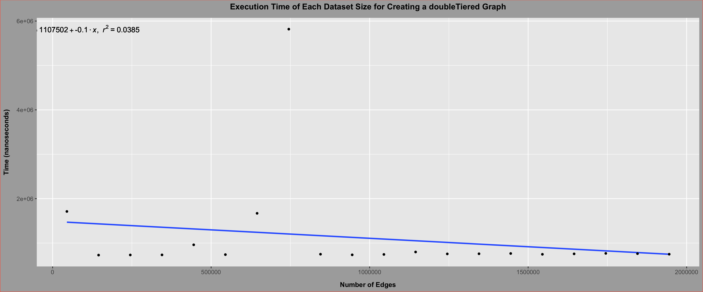

The pattern is extremely weak as we can see an r&sup2 of .038 along with a linear growth of -0.1, so we can therefore claim that there is no linear pattern.
For the random tiered distribution graph with 9000 vertices, we see this linear pattern when timing the Smallest Original Vertex Order Implementation:

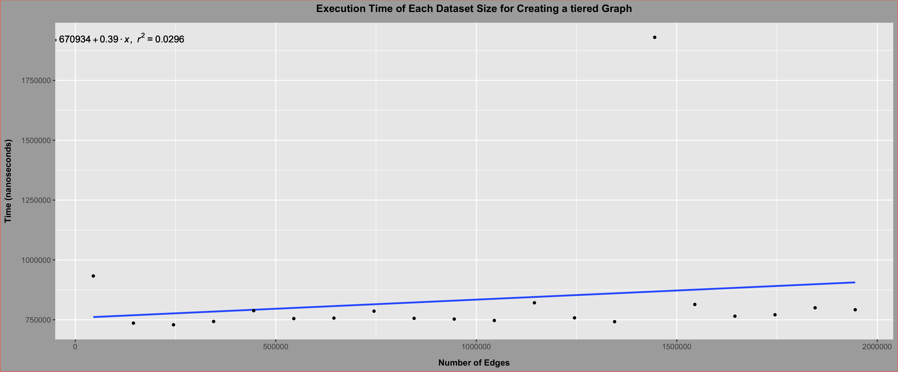

The pattern is extremely weak as we can see an r&sup2 of .10 along with a linear growth of 0.49, so we can therefore claim that there is no linear pattern.
Therefore there is no relation of the number of edges to the amount of time that the Smallest Original Vertex Order takes. This supports the claim that the asymptotic runtime of the algorithm is O(V). 

<table>
    <thead>
        <th>
            Graph Type
        </th>
        <th>
            Vertex Count
        </th>
        <th>
            Time (nanoseconds)
        </th>
    </thead>
    <tbody>
        <tr>
            <td>
                uniform
            </td>
            <td>
                1000
            </td>
            <td>
                106611
            </td>
        </tr>
        <tr>
            <td>
                uniform
            </td>
            <td>
                2000
            </td>
            <td>
                221315
            </td>
        </tr>
        <tr>
            <td>
                uniform
            </td>
            <td>
                3000
            </td>
            <td>
                272250
            </td>
        </tr>
        <tr>
            <td>
                uniform
            </td>
            <td>
                4000
            </td>
            <td>
                428050
            </td>
        </tr>
        <tr>
            <td>
                uniform
            </td>
            <td>
                5000
            </td>
            <td>
                486050
            </td>
        </tr>
        <tr>
            <td>
                uniform
            </td>
            <td>
                6000
            </td>
            <td>
                731450
            </td>
        </tr>
        <tr>
            <td>
                uniform
            </td>
            <td>
                7000
            </td>
            <td>
                668900
            </td>
        </tr>
        <tr>
            <td>
                uniform
            </td>
            <td>
                8000
            </td>
            <td>
                867200
            </td>
        </tr>
        <tr>
            <td>
                uniform
            </td>
            <td>
                9000
            </td>
            <td>
                777950
            </td>
        </tr>
        <tr>
            <td>
                uniform
            </td>
            <td>
                10000
            </td>
            <td>
                1139500
            </td>
        </tr>
    </tbody>
</table>

This table shows a linear growth, as from 5000 to 10000 vertices on a uniformly distributed random graph, it would grow by roughly a factor of 2.

<h3>
Uniform Distributed Random Vertex Order
</h3>

Analyzing this Uniformly Distributed Random Vertex Order Algorithm Implementation gives us a O(V) runtime with V being the number of vertices in the graph. I will leave annotations in the code snippet, but here is a summary of the runtime complexity:

The implementation will iterate through the number of vertices twice. Therefore this iteration will run max V*2 times. For each iteration, it will swap 2 randomly selected vertices which is a constant time operation.

<table>
    <thead>
        <th>
            Graph Type
        </th>
        <th>
            Vertex Count
        </th>
        <th>
            Time (nanoseconds)
        </th>
    </thead>
    <tbody>
        <tr>
            <td>
                uniform
            </td>
            <td>
                1000
            </td>
            <td>
                254888
            </td>
        </tr>
        <tr>
            <td>
                uniform
            </td>
            <td>
                2000
            </td>
            <td>
                389684
            </td>
        </tr>
        <tr>
            <td>
                uniform
            </td>
            <td>
                3000
            </td>
            <td>
                647000
            </td>
        </tr>
        <tr>
            <td>
                uniform
            </td>
            <td>
                4000
            </td>
            <td>
                735400
            </td>
        </tr>
        <tr>
            <td>
                uniform
            </td>
            <td>
                5000
            </td>
            <td>
                1123950
            </td>
        </tr>
        <tr>
            <td>
                uniform
            </td>
            <td>
                6000
            </td>
            <td>
                1139900
            </td>
        </tr>
        <tr>
            <td>
                uniform
            </td>
            <td>
                7000
            </td>
            <td>
                1358950
            </td>
        </tr>
        <tr>
            <td>
                uniform
            </td>
            <td>
                8000
            </td>
            <td>
                1554500
            </td>
        </tr>
        <tr>
            <td>
                uniform
            </td>
            <td>
                9000
            </td>
            <td>
                1798350
            </td>
        </tr>
        <tr>
            <td>
                uniform
            </td>
            <td>
                10000
            </td>
            <td>
                2167700
            </td>
        </tr>
    </tbody>
</table>

This table shows a linear growth, as from 5000 to 10000 vertices on a uniformly distributed random graph, it would grow by roughly a factor of 2.

<h4>
Visualization
</h4>

For my special random double tiered distribution graph with 9000 vertices, we see this linear pattern when timing the Uniformly Distributed Random Vertex Order Implementation:

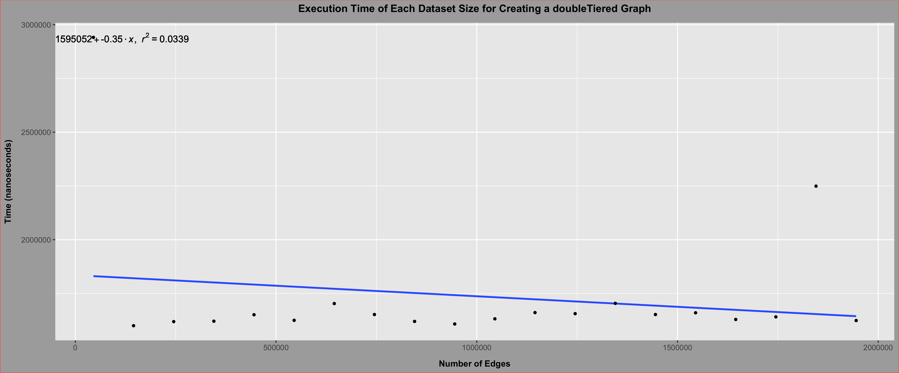

The pattern is extremely weak as we can see an r&sup2 of .034 along with a linear growth of -0.35, so we can therefore claim that there is no linear pattern.
For the random tiered distribution graph with 9000 vertices, we see this linear pattern when timing the Smallest Original Vertex Order Implementation:

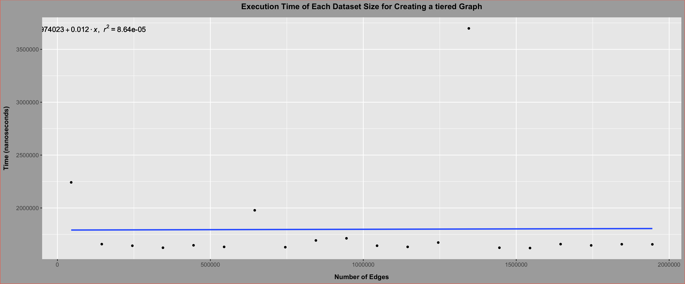

The pattern is extremely weak as we can see an r&sup2 of 8.64*105 along with a linear growth of 0.012, so we can therefore claim that there is no linear pattern.
Therefore there is no relation of the number of edges to the amount of time that the Smallest Original Vertex Order takes. This supports the claim that the asymptotic runtime of the algorithm is O(V). 

<h4>
Comparing Ordering Algorithms
</h4>
<h5>
Maximum Colored Used
</h5>

This metric is good in order to determine the effectiveness of the ordering algorithm in order for the coloring algorithms to use as few colors as possible.

In our findings, we observe that for my custom random distributed graph, the smallest last vertex order algorithm performs better, while random order performs better for uniformly distributed graphs, and they perform comparably for the random tiered graphs. The following table is for 5000 vertices:

<table>
    <thead>
        <th>
            Graph Type
        </th>
        <th>
            Random Order
        </th>
        <th>
            Smallest Last Vertex Order
        </th>   
        <th>
            Smallest Original Vertex Order
        </th>
    </thead>
    <tbody>
        <tr>
            <td>
                complete
            </td>
            <td>
                5000
            </td>
            <td>
                5000
            </td>
            <td>
                5000
            </td>
        </tr>
        <tr>
            <td>
                cycle
            </td>
            <td>
                2
            </td>
            <td>
                2
            </td>
            <td>
                2
            </td>
        </tr>
        <tr>
            <td>
                Random tiered dist
            </td>
            <td>
                1350
            </td>
            <td>
                1384
            </td>
            <td>
                1395
            </td>
        </tr>
        <tr>
            <td>
                Random double tiered dist
            </td>
            <td>
                798
            </td>
            <td>
                790
            </td>
            <td>
                855
            </td>
        </tr>
        <tr>
            <td>
                Random uniform dist
            </td>
            <td>
                482
            </td>
            <td>
                480
            </td>
            <td>
                520
            </td>
        </tr>
    </tbody>
</table>

We can also see that the number of colors needed is much higher for the random distribution in which the first 10% of the vertices have 50% of the edges. This makes those areas of the graph incredibly dense, therefore the odds of having many complete graphs is high. The more edges that connect to one node constitute the more colors that the entire graph will need. This is in contrast with the cycle in which every vertex has 2 edges. Furthermore, the most dense graph, the complete graph, shows the most number of colors here.

Based on this, we can say that either the random ordering or the smallest last vertex ordering are the most effective for coloring, while the size of the terminal clique from the smallest last vertex order provides a hard bound for the minimum number of colors that can be used to color the graph, and the largest degree deleted by the smallest last vertex order provides a theoretical maximum number of colors potentially needed. In the results though, we find that this does not hold true, and that the number of colors needed by the smallest last vertex order consistently is larger than the largest degree deleted.

<h3>
Coloring
</h3>

My coloring algorithm takes in an ordering algorithm, gets the queue from the ordering algorithms and assigns colors based on that. In order to do this, the implementation iterates through the vertices in the queue and explores each vertex’s edges. For each vertex it encounters, it assigns the minimum color it can to stay in a minimum range. But it makes sure that each edge has a different color. For each iteration over each vertex, it iterates over that vertex’s edges, and then it assigns color in min to max order with a max number of colors equal to the number of vertices in the graph.

This implementation evaluates to have a runtime of O(V+E) because of the code evaluation and algorithm summary.

<h4>
Visualization
</h4>

For my random tired graph with 5000 vertices, we see this linear pattern when timing the Coloring Implementation:

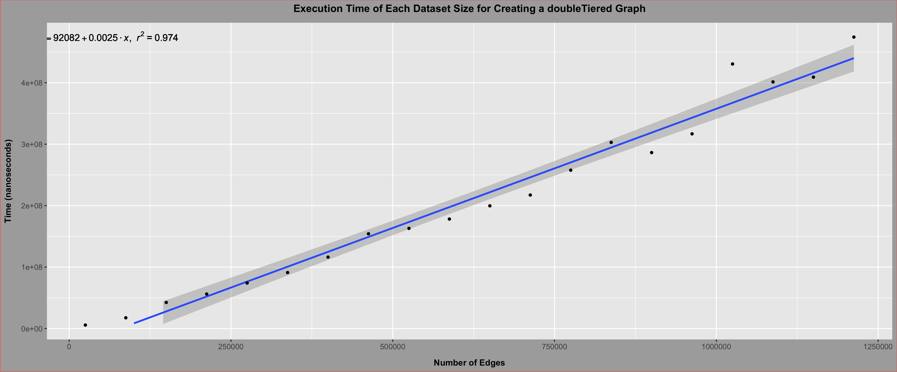

The pattern is extremely strong as we can see an r&sup2 of .974, so there is an extremely strong linear pattern.

For my random tiered distribution graph with 10000 vertices, we see this linear pattern when timing the Coloring Implementation:

The pattern is extremely strong as we can see an r&sup2 of .975, so there is an extremely strong linear pattern.

